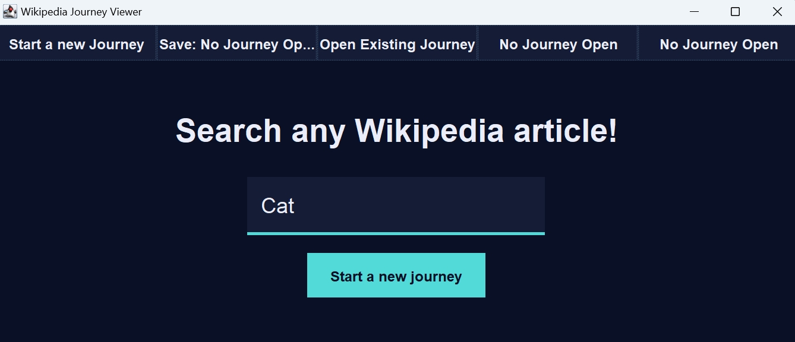
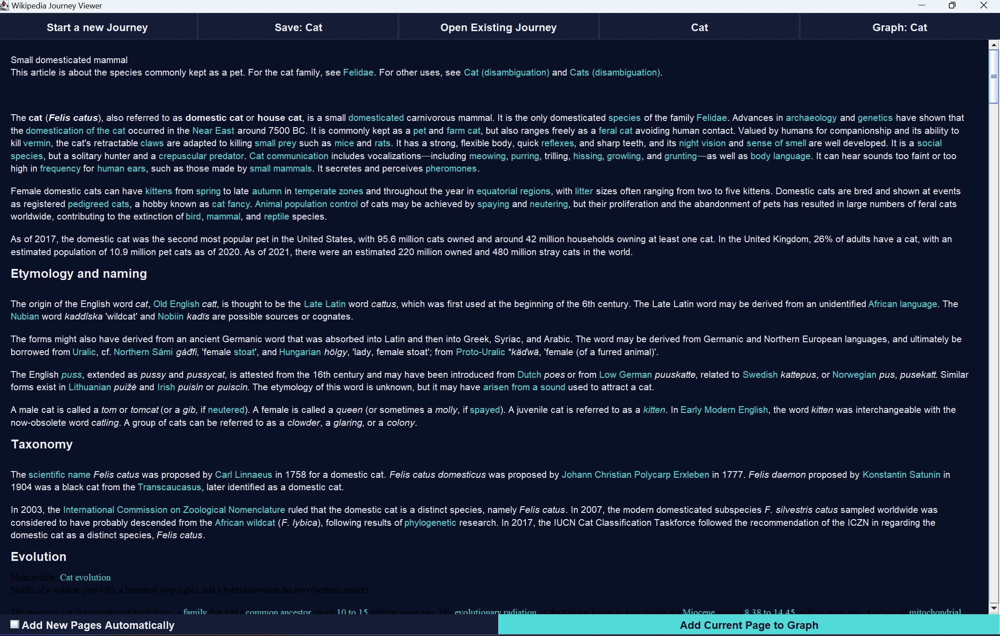
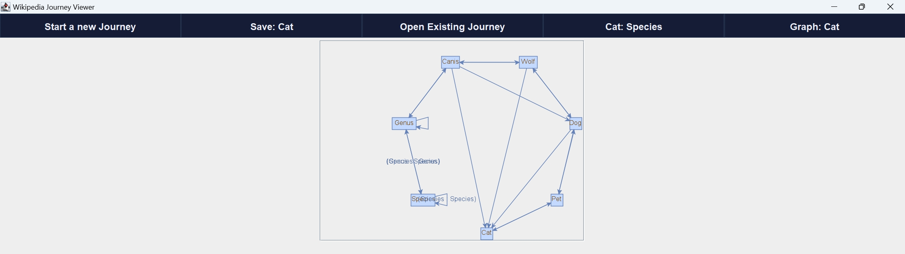
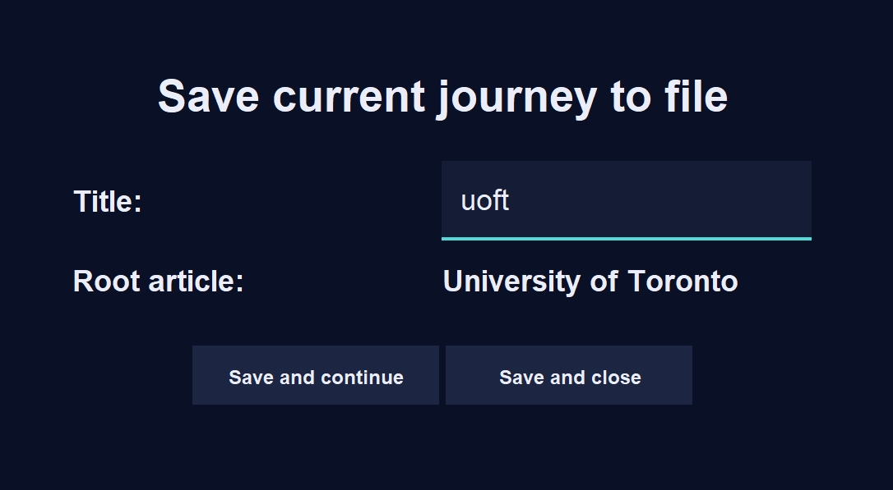
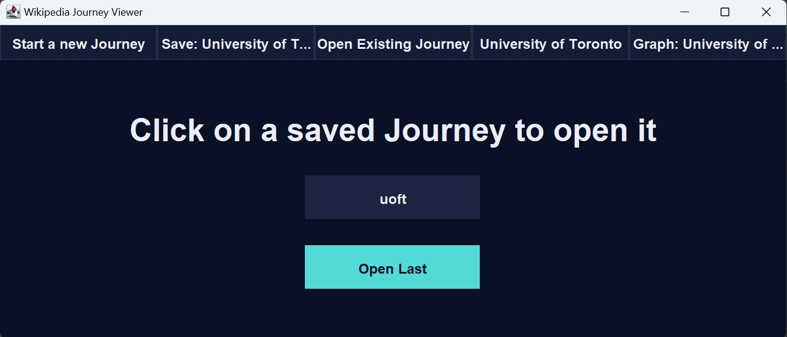
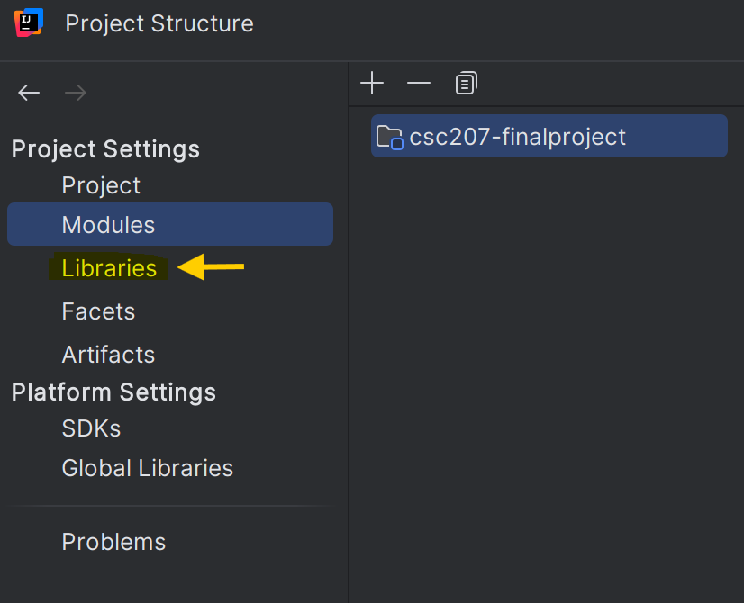
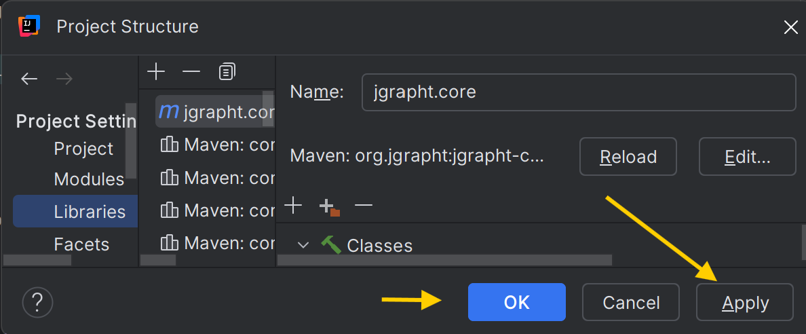
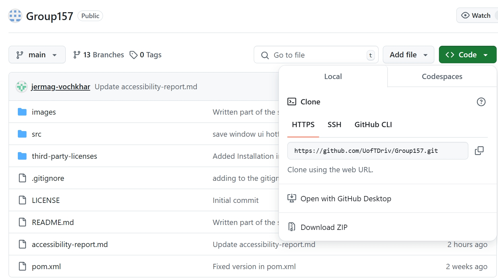
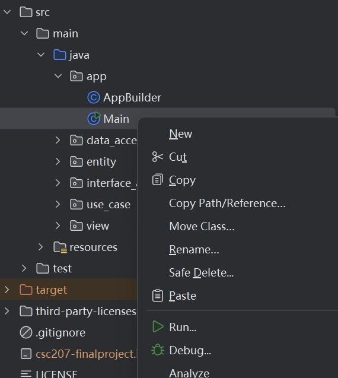

# CSC207 Final Project

## Authors
* Hrunt Jokakelian: https://github.com/jermag-vochkhar
* Denis Rivard: https://github.com/UofTDriv
* Zhe Wang: https://github.com/ZheWang7
* Scott Angelides: https://github.com/JustCookieDough


## Project Purpose

Imagine diving into a completely unfamiliar field—let’s say “artificial intelligence.”
You’re eager to explore, starting with its encyclopedia entry. But as you read, you're bombarded with unfamiliar terms: “statistics,” “computer science,” and more. 
Each term sends you down a rabbit hole of new entries, which lead to even more unexplained concepts. 
It quickly spirals into chaos! How are these ideas connected, and where should you even begin?

The problem lies in the way traditional browsing history works—it’s a simple linear list, showing what you’ve clicked, but not how the concepts relate to one another.
That’s why our team set out to create something different: a “graphical representation” for browsing history. 
In this system, every page you visit becomes a node in a graph. When you explore a related concept, it forms a visible link between nodes. 
This intuitive, hierarchical web of knowledge reveals the relationships between ideas, helping you navigate complex topics with clarity and confidence.


## Table of Contents
### 1. [Authors](#Authors)
### 2. [Project Purpose](#Project-Purpose)
### 3. [Software Features](#Software-Features)
### 4. [Installation Instructions](#Installation-Instructions)
### 5. [License](#License)
### 6. [Usage Guide](#Usage-Guide)
### 7. [Give us Feedback!](#Feedback)
### 8. [How to Contribute?](#Contributions)

## Software Features

### 1. Searching Wikipedia Article
In the "Search Any Wikipedia Article!" page, type the subject you want to serach
into the textbox and click on the `Start a new journey` button. \

The app will display the corresponding Wikipedia page if one exists.

By clicking the hyperlink on the Wikipedia Page, the app will navigate you to the corresponding
page.

### 2. Adding Current Page as a Node
When the user `Start a new journey`, the subject is automatically added as a node.
After navigating to a new page, the user can click `Add Current Page to Graph` to
add the page as a new node. \
The user can check the `Add New Pages Automatically` checkbox to make the app automatically
adds a new node once we navigate to a new page. \
(As the screenshot above)\
The graph links an article with its closest articles that has been added.


### 3. Navigating Back to an Article
The user can return to an "Added" Wikipedia page by clicking the corresponding
node in the graph.

### 4. Saving the Browsing History
The user can save the current browsing history in the "Save" window.
After starting a journey, type in a file name and click `Save and Continue`
or `Save and Close`.


### 5. Opening Past Journey
To open a saved Journey the user can go to the "Open" window.
Click on the name of the file or `Open Last` to open a saved Journey.



=======
## Installation Instructions

### Using Maven to Install the Dependencies

To get started with using this project in your own and installing the dependencies listed, follow these steps:

#### Step 1: Install Maven if not yet installed
1. **Download Maven:**
   - Visit the [Maven Download Page](https://maven.apache.org/download.cgi).
   - Download the latest version of Apache Maven.

2. **Install Maven:**
   - Extract the downloaded archive to a desired directory.
   - Set up the environment variable:
      - Add `MAVEN_HOME` pointing to the Maven directory.
      - Add `MAVEN_HOME/bin` to your system's `PATH`.

#### Step 2: Add Dependencies
1. Open your project's `pom.xml` file.
2. Add the following dependencies under the `<dependencies>` section:
   ```xml
   <dependencies>
       <!-- JSON Library -->
       <dependency>
           <groupId>org.json</groupId>
           <artifactId>json</artifactId>
           <version>20240303</version>
       </dependency>

       <!-- JGraphT Core -->
       <dependency>
           <groupId>org.jgrapht</groupId>
           <artifactId>jgrapht-core</artifactId>
           <version>1.5.2</version>
       </dependency>

       <!-- JGraphT Extensions -->
       <dependency>
           <groupId>org.jgrapht</groupId>
           <artifactId>jgrapht-ext</artifactId>
           <version>1.5.2</version>
       </dependency>

       <!-- JGraphX -->
       <dependency>
           <groupId>com.github.vlsi.mxgraph</groupId>
           <artifactId>jgraphx</artifactId>
           <version>4.2.2</version>
       </dependency>

       <!-- OkHttp -->
       <dependency>
           <groupId>com.squareup.okhttp3</groupId>
           <artifactId>okhttp</artifactId>
           <version>4.12.0</version>
       </dependency>

       <!-- JUnit for Testing -->
       <dependency>
           <groupId>junit</groupId>
           <artifactId>junit</artifactId>
           <version>4.13.1</version>
           <scope>test</scope>
       </dependency>
       <dependency>
           <groupId>org.junit.jupiter</groupId>
           <artifactId>junit-jupiter</artifactId>
           <version>5.8.1</version>
           <scope>test</scope>
       </dependency>
   </dependencies>
   ```

#### Step 3: Build the Project
1. Open a terminal and navigate to your project directory.
2. Run the command to download and install the dependencies.

#### Step 4: Verify Setup
- Ensure no errors occur during the build process.

--- 

#### Using Maven with IntelliJ IDEA

1. In IntelliJ IDEA, libraries can be defined in the **Project Structure** dialog. **Go to File | Project Structure**, or press **Ctrl+Shift+Alt+S**. This will then allow you to define a project library when select **Libraries** under the Project Settings section.
    
2. Click the **green +** sign, and select **From Maven**.
   
3. In the **Download Library From Maven Repository** window, type the dependency names below, i.e. `org.json:json`, into the search bar and press enter. After the search completes, you can select the drop-down button on the search bar and select the desired library module and version (also listed below).
   
4. Back in the **Project Structure** screen, click **apply**, and then **ok**.
   
5. Repeat for each dependency and you should see them appear in the Project overview in the **External Libraries** section. 
 
## Dependencies

This project uses the following dependencies:
- Requires JDK 11 or later to build.
- **org.json:json** - Version: `20240303` **License**: [JSON License](https://www.json.org/license.html)
- **org.jgrapht:jgrapht-core** - Version: `1.5.2` **License**: [GNU Lesser General Public License (LGPL)](https://www.gnu.org/licenses/lgpl.html)
- **org.jgrapht:jgrapht-ext** - Version: `1.5.2` **License**: [GNU Lesser General Public License (LGPL)](https://www.gnu.org/licenses/lgpl.html)
- **com.github.vlsi.mxgraph:jgraphx** - Version: `4.2.2` **License**: [BSD License](third-party-licenses/JGraphX BSD License)
- **com.squareup.okhttp3:okhttp** - Version: `4.12.0` **License**: [Apache License 2.0](https://www.apache.org/licenses/LICENSE-2.0)
- **junit:junit** - Version: `4.13.1` **License**: [Eclipse Public License 1.0](https://opensource.org/licenses/EPL-1.0) **Note**: This dependency is used for testing purposes only.
- **org.junit.jupiter:junit-jupiter** - Version: `5.8.1` **License**: [Eclipse Public License 2.0](https://www.eclipse.org/legal/epl-2.0/) **Note**: This dependency is used for testing purposes only.

## Usage Guide
### Step 1:
To use the software, make sure you have followed the instructions in the [Installation Instructions](#installation-instructions)
section if you haven't have the packages and dependencies ready.
### Step 2:
Clone the project or download the zip file in [Our GitHub Repository](https://github.com/UofTDriv/Group157)
Open the project in your IDE.

### Step 3:
In **src/main/java/app**, find the file named `Main`.
Rightclick the file and click **Run** or open the file to run it.

### Step 4:
Seeing the App displayed and you are ready to start your journey!
(See the [Software Features](#software-features) section for a tutorial of the app)

## License

Distributed under the Creative Commons Zero v1.0 Universal License. Project is dedicated to the world-wide public domain. The creators of the project (Hrunt Jokakelian, Denis Rivard, Zhe Wang, Scott Angelides) disclaim responsibility for obtaining any necessary consents, permissions or other rights required for any use of this project. See LICENSE for more information.

## Feedback

Curious on giving feedback and or giving suggestions on how to improve the project? Send in a response to the following google form:
https://forms.gle/M7uPDBEbZgMDvskc7

What counts as valid feedback?
- Written in English only
- Should be aligned with project goals (i.e. the purpose of the project)
- Provide actionalable suggestions (NOT vague or abstract critiques)

Guidelines for what to expect when writing feedback?
- Be clear and specific
- Be professional and respectful
- Aim for constructiveness (don't be overly critical)

## Contributions

How can users contribute to the project?
Users can contribute in two ways:
- Providing feedback via actionalable suggestions (as previously mentioned under 'Feedback')
- Adding further use cases to the project
     - NOTE: that this does not allow the mutation of already existing use cases

How can users make a fork of this repo?
 1. Navigate to the home page of the repository
 2. In the top right of the page, click on 'Fork'
 3. Leave the 'Owner' selection as is. Change 'Repository Name' to the following format: {github username}_{fork number}, where 'fork number' specifies whether this is the first, second, third etc. fork you've made of this repo.
 4. Adding a description is not necessary
 5. Ensure that 'Copy the main branch only' is selected
 6. Click on 'Create fork'

Guidlines for creating a good merge request.
1. Write clear commit messages
2. Ensure code quality (Follow some kind of linter e.g SolarLint)
3. Appropriately use branching (i.e. create a branch when implementing a distinct feature or use case)
4. Ensure that the merge quest description is thorough
     - What does the merge request do?
     - Why are the changes necessary?
     - How were the changes implemented
5. Provide evidence of successful testing (i.e. screenshots for changes to the UI) and adequate test coverage from provided test suite (at least 90% code coverage for core logic)

Protocols for reviewing and merging contributions.
1. Automatic testing: automatic tests will be run to ensure that code in the merge request is correct and compatible with the current codebase.
2. Review. A review will be selected to review your merge request. Expect merge requests to be completed between 2 and 5 business days. Reviewers will take into consderation the aformentioned criteria/guidlines for a good merge request. 
4. Feedback. The reviewer will provide any necessary feedback regarding the request (NOTE: any merge requests NOT following these guidelines will be ignored and DELETED)
5. Approval mechanism. An additional reviewer may be called for a second opinion before merging.


### 
