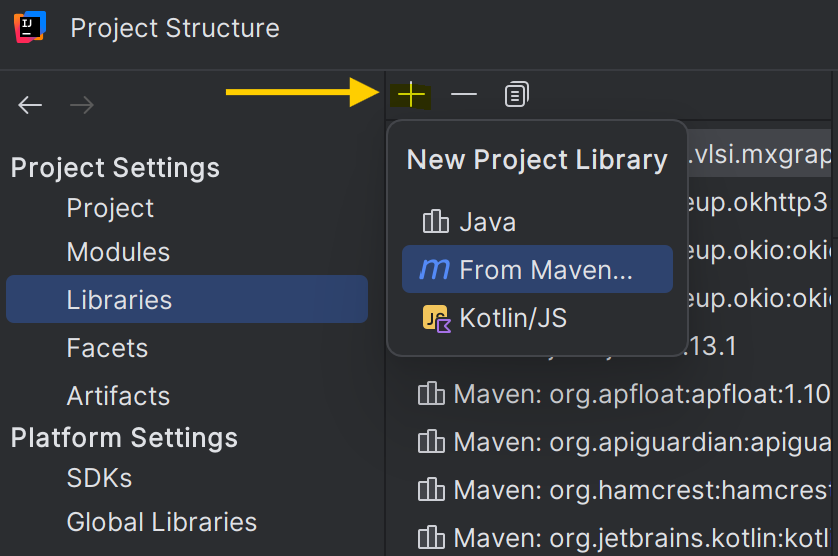
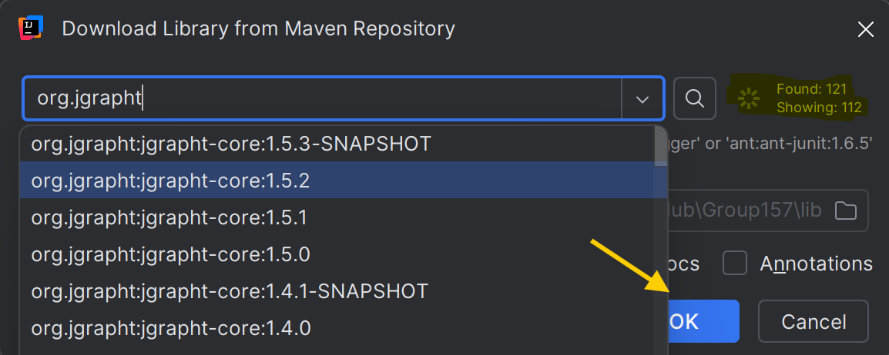

# CSC207 Final Project

## Group Members
* Hrunt Tyler Jokakelian: https://github.com/jermag-vochkhar
* Denis Divard: https://github.com/UofTDriv
* Zhe Wang: https://github.com/ZheWang7
* Scott Angelides: https://github.com/JustCookieDough

## TODOs by Fri 8 Nov
1. [X] Use cases described and user interations identified - James
2. [X] All the Views sketched - Denis
3. [X] Entities decided - James

## TODOs by Sun 17 Nov
4. [ ] A first "team use case" implemented, tested, and pushed to repo - 
   * Controller, input data, interactor, output data, presenter, in memory database (if needed)
5. [ ] Be able to make calls to the API your team has chosen - 
6. [ ] Functioning view and view model


## Project Blueprint
### Team Name: 
WSHD
### Domain: 
Graphing Wikipedia Rabbit Holes
### Software Specification:
A program that makes a graph of what you have seen as you search through Wikipedia. 
As you click links in existing articles to new articles it creates a new node for said article on the map.  
### Features to be implemented (User Stories)
1. [X] Type in a subject and click on `Search`: the program will display the page and create a new node. (Team Use Case) 
2. [ ] Journey UseCase: Display the searched article as the root and be able to `Click` the links in the page: the program will display that page. (Denis)
3. [ ] The searched article is added as the root node to the Graph of your current journey, any new articles you `click` will be added and linked to the previous node. (Zhe Wang)
4. [ ] As you explore more pages you can see a list of past pages visited but the program also automatically `adds links` between nodes that were not originally connected by traversal. (Scott)
5. [ ] `Save` and `Open` your research journeys at another time by saving your current journey to a human-readable file that can be imported. (Hrunt)

**(Complexity Requirements already satisfied. Additional Features to make the project outstanding)**

6. [ ] During your exploring there may be articles you have not clicked on but are linked to by more than 2 articles you have visited.
The program will create `Ghost Nodes` for these articles.
7. [ ] `Switch` the history between **graph** and **chronological list**
### Proposed API for the Domain
#### [MediaWiki Action API](https://www.mediawiki.org/wiki/API:Main_page)
* Allows us to easily interact with MediaWiki-based online resources like English Wikipedia.
* Pulling down the HTML of English Wikipedia for display using swing.
* Accessing the MediaWiki `pagelinks` database, which stores all of the links between Wikipedia articles.
* Abstracts away difficult to handle features of MediaWiki sites such as redirects or deprecated pages.
#### [Another API for graph (TBD)]()
(Add once determined)


## CA Structures of Use Cases
### Search

1. When the user types in the subject in the textbox and click **Search**, the content in the textbox
will be passed to the `SearchController`.
2. The `SearchController` will wrap the input into a `SearchInputData` object,
which will be used by the `SearchInputBoundary` interface.

**(I'm not sure if the `SearchInputData` is necessary because the data is really just a String of the subject name.
I'll ask the TA on Monday)**

3. `SearchInteractor` implements the `SearchInputBoundary` interface, which calls the MediaWiki API.
to fetch the corresponding webpage. The fetched result will be stored in `Webpage`.
4. `SearchInteractor` then returns `SearchOutputBoundary`.
5. `SearchPresenter`, which implements the `SearchOutputBoundary` interface, will then update the `ViewModel`.
6. `ViewModel` fires the changes to display the webpage on the `View`.

### Add
The structure of the **Add** use case would be similar to that of **Search**.
The potential entities involved are `Node` (the node representing a webpage), and
`WikiHistory` (storing the Wikipedia Rabbit Hole).

### Save


## Installation Instructions

### Using Maven to Install the Dependencies

To get started with using this project in your own and installing the dependencies listed, follow these steps:

#### Step 1: Install Maven if not yet installed
1. **Download Maven:**
   - Visit the [Maven Download Page](https://maven.apache.org/download.cgi).
   - Download the latest version of Apache Maven.

2. **Install Maven:**
   - Extract the downloaded archive to a desired directory.
   - Set up the environment variable:
      - Add `MAVEN_HOME` pointing to the Maven directory.
      - Add `MAVEN_HOME/bin` to your system's `PATH`.

#### Step 2: Add Dependencies
1. Open your project's `pom.xml` file.
2. Add the following dependencies under the `<dependencies>` section:
   ```xml
   <dependencies>
       <!-- JSON Library -->
       <dependency>
           <groupId>org.json</groupId>
           <artifactId>json</artifactId>
           <version>20240303</version>
       </dependency>

       <!-- JGraphT Core -->
       <dependency>
           <groupId>org.jgrapht</groupId>
           <artifactId>jgrapht-core</artifactId>
           <version>1.5.2</version>
       </dependency>

       <!-- JGraphT Extensions -->
       <dependency>
           <groupId>org.jgrapht</groupId>
           <artifactId>jgrapht-ext</artifactId>
           <version>1.5.2</version>
       </dependency>

       <!-- JGraphX -->
       <dependency>
           <groupId>com.github.vlsi.mxgraph</groupId>
           <artifactId>jgraphx</artifactId>
           <version>4.2.2</version>
       </dependency>

       <!-- OkHttp -->
       <dependency>
           <groupId>com.squareup.okhttp3</groupId>
           <artifactId>okhttp</artifactId>
           <version>4.12.0</version>
       </dependency>

       <!-- JUnit for Testing -->
       <dependency>
           <groupId>junit</groupId>
           <artifactId>junit</artifactId>
           <version>4.13.1</version>
           <scope>test</scope>
       </dependency>
       <dependency>
           <groupId>org.junit.jupiter</groupId>
           <artifactId>junit-jupiter</artifactId>
           <version>5.8.1</version>
           <scope>test</scope>
       </dependency>
   </dependencies>
   ```

#### Step 3: Build the Project
1. Open a terminal and navigate to your project directory.
2. Run the command to download and install the dependencies.

#### Step 4: Verify Setup
- Ensure no errors occur during the build process.

--- 

#### Using Maven with IntelliJ IDEA

1. In IntelliJ IDEA, libraries can be defined in the **Project Structure** dialog. **Go to File | Project Structure**, or press **Ctrl+Shift+Alt+S**. This will then allow you to define a project library when select **Libraries** under the Project Settings section.
    
2. Click the **green +** sign, and select **From Maven**.
   
3. In the **Download Library From Maven Repository** window, type the dependency names below, i.e. `org.json:json`, into the search bar and press enter. After the search completes, you can select the drop-down button on the search bar and select the desired library module and version (also listed below).
   
4. Back in the **Project Structure** screen, click **apply**, and then **ok**.
   
5. Repeat for each dependency and you should see them appear in the Project overview in the **External Libraries** section. 
 
## Dependencies

This project uses the following dependencies:
- Requires JDK 11 or later to build.
- **org.json:json** - Version: `20240303` **License**: [JSON License](https://www.json.org/license.html)
- **org.jgrapht:jgrapht-core** - Version: `1.5.2` **License**: [GNU Lesser General Public License (LGPL)](https://www.gnu.org/licenses/lgpl.html)
- **org.jgrapht:jgrapht-ext** - Version: `1.5.2` **License**: [GNU Lesser General Public License (LGPL)](https://www.gnu.org/licenses/lgpl.html)
- **com.github.vlsi.mxgraph:jgraphx** - Version: `4.2.2` **License**: [BSD License](third-party-licenses/JGraphX BSD License)
- **com.squareup.okhttp3:okhttp** - Version: `4.12.0` **License**: [Apache License 2.0](https://www.apache.org/licenses/LICENSE-2.0)
- **junit:junit** - Version: `4.13.1` **License**: [Eclipse Public License 1.0](https://opensource.org/licenses/EPL-1.0) **Note**: This dependency is used for testing purposes only.
- **org.junit.jupiter:junit-jupiter** - Version: `5.8.1` **License**: [Eclipse Public License 2.0](https://www.eclipse.org/legal/epl-2.0/) **Note**: This dependency is used for testing purposes only.
